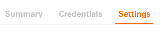

# Enable Workspaces

## What are Workspaces?

Workspaces are dedicated spaces for developers to manage their Fiserv product integrations and projects. Each workspace may contain a different suite of self-service tools, outlined steps for integration, requirements and sharing permissions as set forth by the specific Fiserv product being integrated to. Developers can create a workspace for any supported Fiserv Product (not all products support workspaces or self-service functionality)

Although each workspace may have different requirements and tools, all workspaces will contain the same set of standard features with a consistent interface as outlined in this how-to guide.

## Enable Workspaces for users

### Create Account on Developer Studio

Please refer our [Create Account Guide](create-account.md) on this.

### Create Workspace

1. **Create account** or **Log-in**;

2. Select **Workspaces** from global header (next to account avatar)

3. Create a new workspace;

    a. Enter Name
    b. Enter Description
    c. Select Product Area from dropdown (preselected at this time)
    d. Select Product Integration from dropdown.

_<mark style="color:red;">Please note: If you do not find your product in the dropdown, please shoot us a message using our</mark>_ [Support](https://github.com/fiserv/support/issues).

    e. Hit the **Create Workspace** button

### Manage Workspace

1. **Create account** or **Log in**

2. Select **Workspaces** from global header (next to account avatar)

3. Select specific workspace from the left navigation or workspace cards

4. View workspace Summary

5. Manage Credentials

&#x20;   a. Click **Credentials** on the tab to go to the Credentials page

&#x20;   b. View MID (Merchant Identifier) details by selecting the **View** button in MID table

&#x20;  c. Add/Create API Key by selecting the **Create API key** button

     i. Select MID from dropdown. This will be the MID associated with the API key you are creating. _This step might differ for different tenants._

     ii. Name the API Key you are creating

     iii. Select Environment (if available)

     iv. Add Features (if applicable)

     v. Hit the **Create** button

     vi. Download API Key details as a pdf file (this is your one chance to save the API Key details including secret)

d. Add/Create CSR (Certificate Signing Requests) by selecting the **Create CSR** button             i. Enter the common name (name your CSR)

&#x20;            ii. Select Apple Pay from wallet dropdown

&#x20;            iii. Enter Organization Name

&#x20;            iv. Enter Organization Unit

&#x20;            v. Select Country/Region from dropdown

&#x20;            vi. Enter State/Province

&#x20;            vii. Enter City/Locality

&#x20;            viii. Enter an optional description

&#x20;            ix. Hit **Create** button

e. View CSR Details by selecting the **View** button in the CSR table (only available after creating/adding a CSR)

f. Download CSR and upload to Apple to complete the CSR process for your application

6. Update Settings

a. Click **Settings** on the tab to go to the Settings page

b. Hit **Edit** button

   i. Change Workspace Name

   ii. Change Workspace Description

c. Delete Workspace by hitting the **Delete** button

7. Gated Content

You can also use workspaces for 'Gated Content'. "Gated Content" is a mechanism developed to control file visibility and permissions on Developer Studio. Read more about this here: [Gated Content](how-to-use-gated-content.md)
