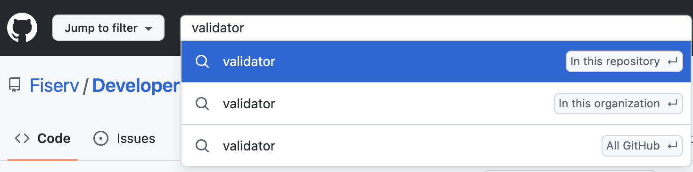

# Search - Github Fiserv Organization

Using the global search, you can search  any information to your own public repositories and any private repositories you have access to.

When you’re on a repository page, you’ll see an indication that you’re searching that repository by default. 

To start a search, in the top-left corner of the screen, in the search bar, type your search query.

- The first suggested result will be tagged "in this repository". 

- The second suggested result will be tagged "in this organization".

- The third suggested result will be tagged "All Github".

For eg: On Fiserv repo's homepage, type your search term into the search box on the top left. 

When you’re on a repository page, you’ll see an indication "in this repository" that you’re searching that repository. 

Finally, if you didn’t find what you were looking for in your repository, or in the organization, you can turn a repository search into a global search by clicking Search "All GitHub".

