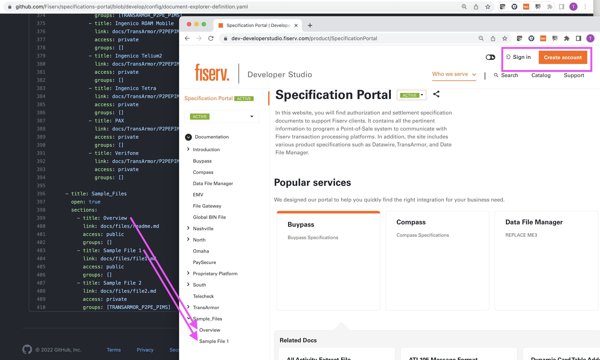
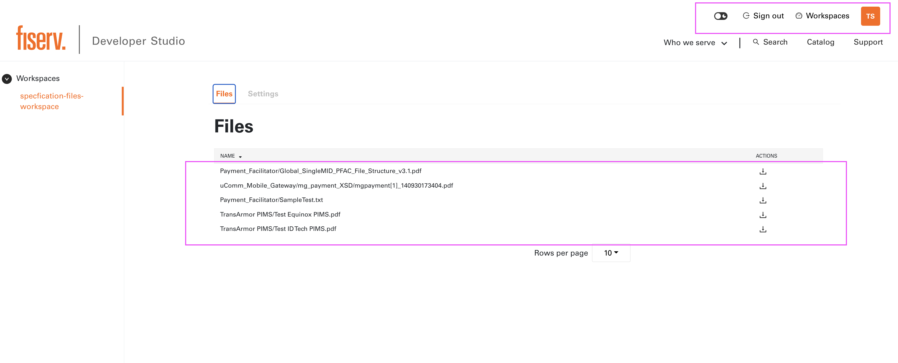

# What is Gated Content?

"Gated Content" is a mechanism developed to control file visibility and permissions on Developer Studio. 

The different levels of accesses are:

**Public Access** : when all users can access the files publicly. 

**Private Access** : when a user can only view the files when they are signed in Developer Studio. 

**Private Entitled Access** : when signed in users with the appropriate access or entitlements to the files can access them. This is the most protected level of access. To gain this access users have to become a member of the entitled group.

# Add Gated Content access for Markdown files

The document-explorer-definition.yaml in the config folder defines documentation tree on left navigation panel and this is where the file accesses needs to be added. If a file has "access: public" defined for it, then everyone can see it. 

If the file has "access: private" and "groups: [no groups specified]" meaning, only users who have signed in Developer Studio are permitted to view it. 

If the file has "access: private" and "groups: [ABC_BANK]" meaning, only users who have signed in Developer Studio and also belong to the group "ABC_BANK" are permitted to view it. Multiple groups can also be defined here like  "groups: [ABC_BANK, XYZ_BANK]"

# Add Gated Content access for API endpoints

Coming soon...

# Add Gated Content access for other Assets

Coming soon...

# Provide 'Private Entitled Access' to users

As of today this part is manual and solely maintained by Developer Studio Team.

# Admin UI and Notification Service for users

Coming soon...
