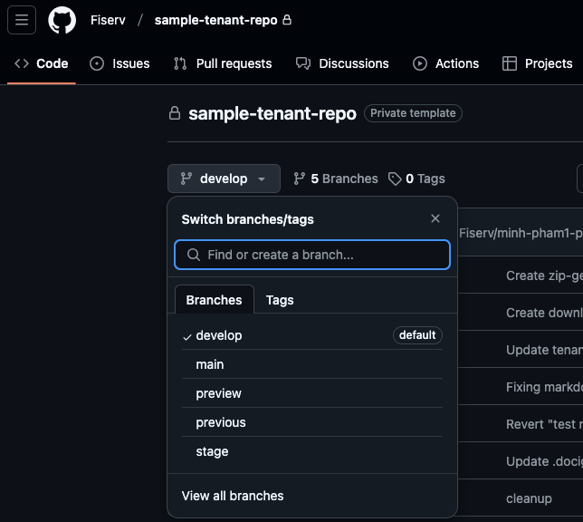
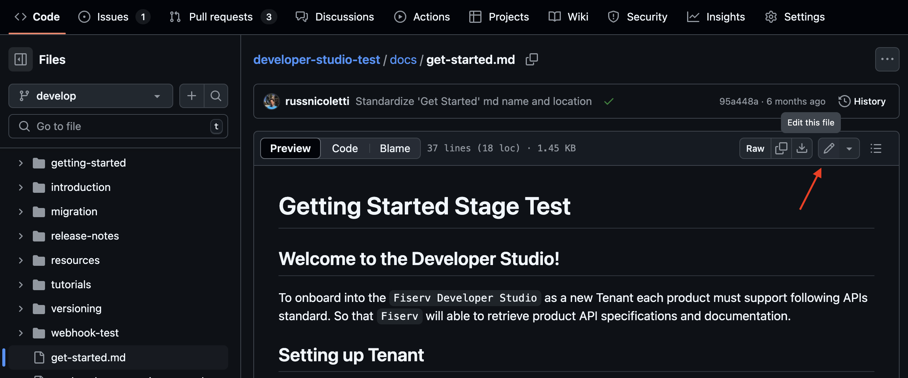
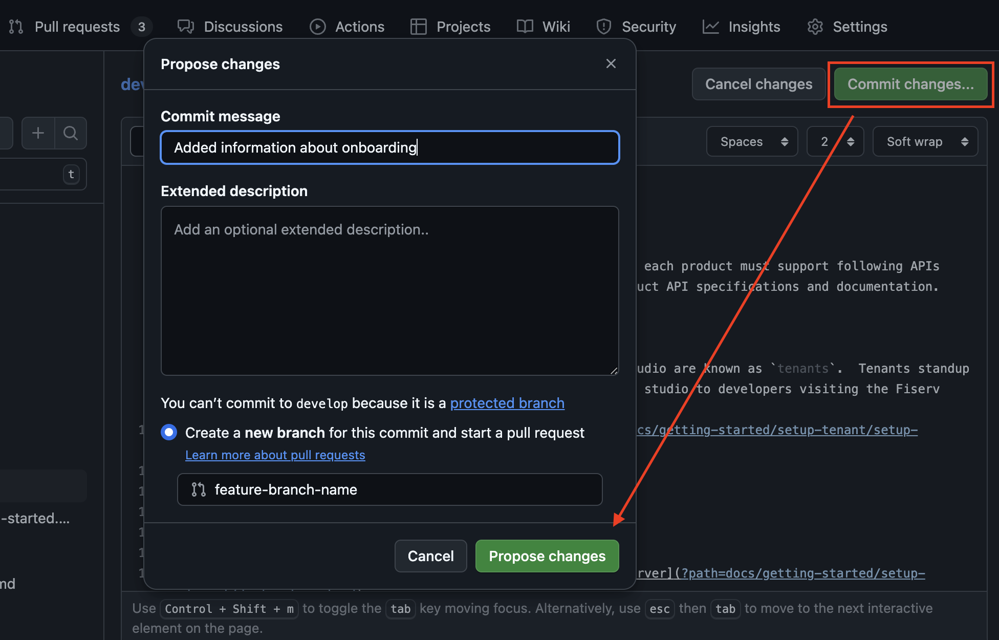
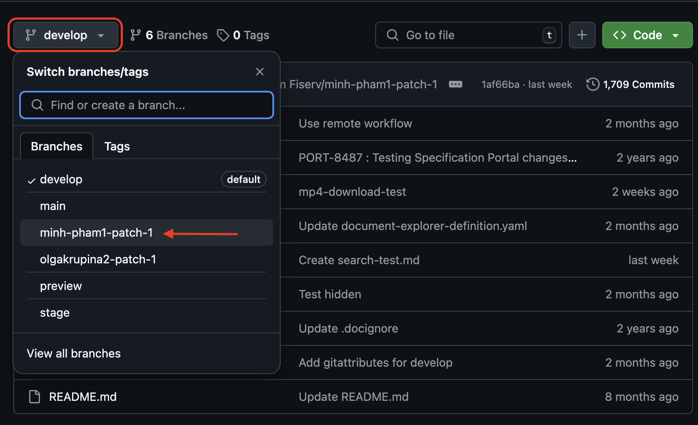
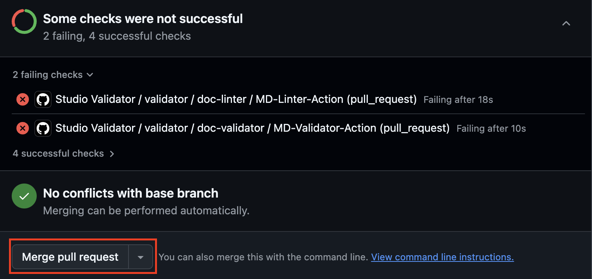
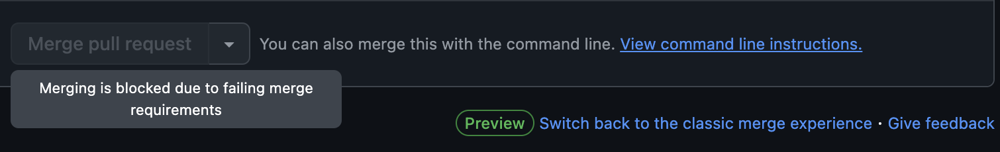
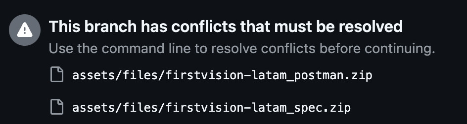

# How to create pull requests and update your content

This guide will briefly explain how to use Github for changing files and the proper method to commit changes to the `develop`, `stage`, and `main` branch.

Since these 3 branches are utilized by Developer Studio to display your content, we do not allow direct pushes to them. Instead, you will need to make feature branches to commit to these base branches to allow our validators to validate all new changes and create accountability if any documentation or API specs encounter any issue.

We highly recommend making changes to the `develop` branch and merge `develop -> stage -> main` in sequence as per standard Git versioning process. For those using the `preview` branch feature, you would do `preview -> develop` first.



## Making changes using Github web IDE

1. Navigate to document you need to edit and start editing process (for deletion, `...` menu near the top right will allow you to delete)

  
2. Once done editing, click `Commit`, set the message, and commit to a new branch with a descriptive branch name
  
  
3. To edit other documents in the same pull request, navigate back to `Repository`, select the branch you just committed to, then repeat step 1&2

  

## Creating a feature branch from `develop` via command line

```bash
git checkout develop
git checkout -b feature-branch-name
```

After making changes

```bash
git add .
git commit -m "Description of the changes"
git push origin origin/feature-branch-name
```

## Creating a GitHub Pull Request

- Go to your repository on GitHub.
- Click on the "Pull requests" tab.
- Click the "New pull request" button.
- Select `develop` as the base branch and `feature/your-feature-name` as the compare branch.
- Add a title and description for your pull request.
- Click "Create pull request".

**Review and merge:**

- Wait for [validators](validator/studio-validators.md) to complete. Validators marked with the `Required` tag **must** succeed.
- Pull request review is _optional_, we can enforce it upon request but merging is at your team's discretion.

## Common issues

* The merge request button is grayed out. Do I need approval or fix all these validator failures?
  * Light gray button usually appear if optional validators failed, meaning you can still merge but are being warned that there is an issue. Fully gray button indicate an actual blocker.

    Ok:
    
    
    Not ok:
    

* There are some zip file merge conflicts that I didn't touch such as `assets/files/<product-name>_postman.zip`

  * We automatically generate a new zip file for you when we detect that file(s) in the `reference/` directory has changed. However, this means that each branch may unfortunately have slightly differing versions. We are working to remediate this but the process is somewhat complex.

    You can reach out via Teams/Github for help. Alternatively, we recommend you sync the commit histories by doing the following (example will be for merge conflict `develop -> stage`):
    ```bash
    git checkout develop
    git checkout -b develop-sync
    git merge origin/stage -X ours
    git push
    ```

    Once you merge `develop-sync -> develop`, the merge conflict should be resolved.
