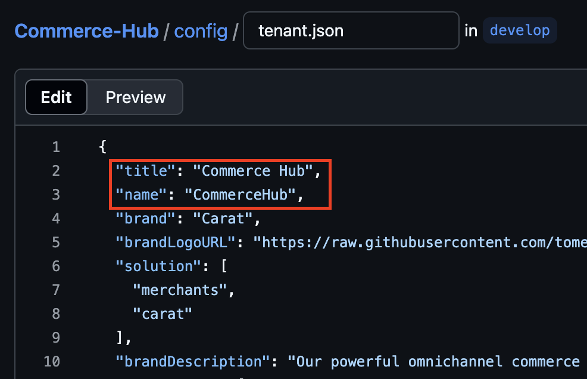
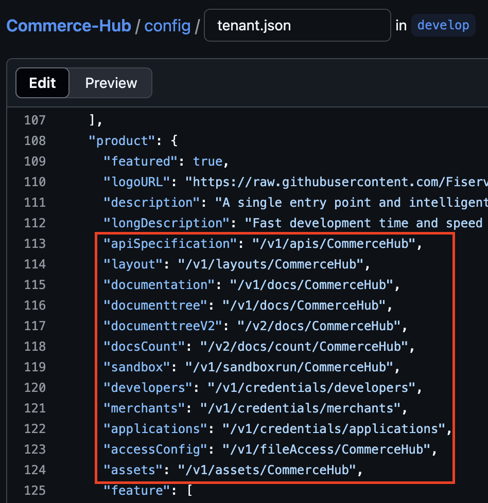

# Configuration changes requiring Developer Studio team

While many configurations can be changed on Github and reflected immediately, some tenant changes require the Developer Studio internal team to change values and settings for in our backend. As such, please submit an **enhancement** request on our [Github support page](https://github.com/Fiserv/Support/issues) to get these changes made.

## Table of Content

- [**Name change**](#name-change)
    - [**Github repository name change**](#github-name-change)
- [**Live <-> mock prism server**](#api-mock-server-change)
- [**Adding member**](#adding-member)
- [**Product tags**](#product-tags)
- [**Sales contact**](#sales-contact)

### Name change

For this update, we will need to know the name of your repository currently and the name+title you would like to be changed to.

* Name: No-space, pascal-case name as it would appear in the URL (i.e. `Commerce Hub` appears as https://developer.fiserv.com/product/**CommerceHub** in the Developer Studio URL)
* Title: How your tenant name would appear on the product homepage, Search, top-level menu, etc.

We will make the necessary changes on our backend and deploy it up through our lower and upper environment as per our deployment schedule.

On Github, you will need to make the following changes to your `tenant.json` in preparation for the deployment date. You may merge the change to the respective branch on the day of or before the deployment (a DevStudio member may assist you in the actual merge but it is suggested you create the PR and have it on standby for them).

- title
- name
- product.apiSpecification
- product.layout
- product.documentation
- product.documenttree
- product.documenttreeV2
- product.docsCount
- product.sandbox
- product.developers
- product.merchants
- product.applications
- product.accessConfig
- product.assets

*Hint:* It is easiest to simply do a *Replace all* operation in `tenant.json` searching for your old product name (Change `CommerceHub` -> `eCommerceHub`) which should automatically change everything needed in the `tenant.json` other than the `title `field.

#### Github name change

You may also request to rename the name of your entire Github repository. Since Github can retroactively check for old names, we can usually change it on our end without any additional effort on your end. However, it still requires a backend change so it will not take effect until that sprint's work has been deployed to various environments.

You may open a separate request or use the same as above, mentioning what the new Github name should be. For this, the standard naming convention is to use kebab case (i.e. `commerce-hub`).

### API mock server change

As you develop your API documentation and specs, you may want to implement and host your own dynamic sandbox server or use our more basic Prism mock server. While you have undoubtedly chosen one already upon creating your tenant, you may request a change at any time in either direction.

Please open a ticket mentioning your product name and the type of sandbox you would like it to be converted to. For our Prism mock server, you will not need to provide any additional information. 

If you are switching to your own sandbox server endpoint, you'll need to give us the authentication protocol/method and a team member will reach out to you via email or Teams to get the username/password or hash signature needed to authenticate.

After the switch has been deployed, we will do some basic validation on that environment to check whether responses from various requests seem to behave the same as before the change. Tenants are, of course, expected to do their own validations. These validations and process will be updated and commented on in the Github issue ticket.

### Adding members

The easiest request to fulfill, you may request for this through either Github Issue or with a short message on our `Feedback and Help!` Teams channel.

You may request for additional members to get access to your Github or remove members who are either inactive or terminated. We recommend you have no more than 7 members in your team at a single time, though there are some exceptions.

For new members, we will request that an existing member or manager verify/approve of their request to join for security purposes. We'll need their Github ID (or email if they do not already have a Github account) along with what repository they need Write access to.

For existing member, we only need to know their Github ID to remove them from the organization.

For those who lost access to their repository due to inactivity, you may mention the fact that you have lost access along with your Github ID. A Developer Studio team member will search for revoked users using that ID and can reinstate you to your previous permissions.

If you need many people to view the Github content directly without `Write` access, we recommend you look into requesting a service account with Fiserv to have a shared credential. This will simplify security and auditing process, as well as save us the amount of Github seats/member slots which we pay for.

### Product tags

We can also change any filters you would like to be listed under for Catalog/Search as listed [here](tenant-basics#product-tags-for-searching-and-filtering). Please let us know in the Github ticket which field(s) you would like to add, remove, or change.

### Sales contact

You may provide us with a sales contact (in addition to your Client360/support point of contact that is **required** for becoming a production tenant) who can provide support for prospective customers looking for help to make a purchase, test integration, or otherwise need help with obtaining credentials for your product. This sales contact will be added to our internal documentation for on-call support to contact when the specific inquiry appears. They can be either a Client 360 assignment group (preferred) or an email address.

Given this information, we can enable you as a product under the `Get assistance -> Contact sales` dropdown menu for customers to properly categorize their inquiry.
