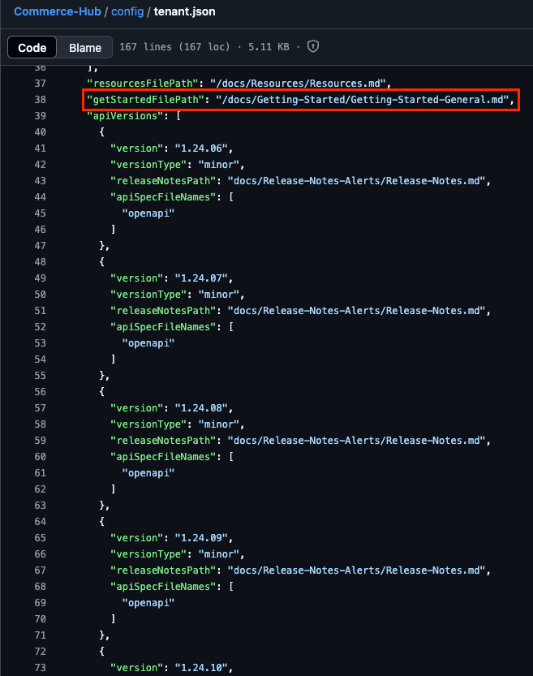
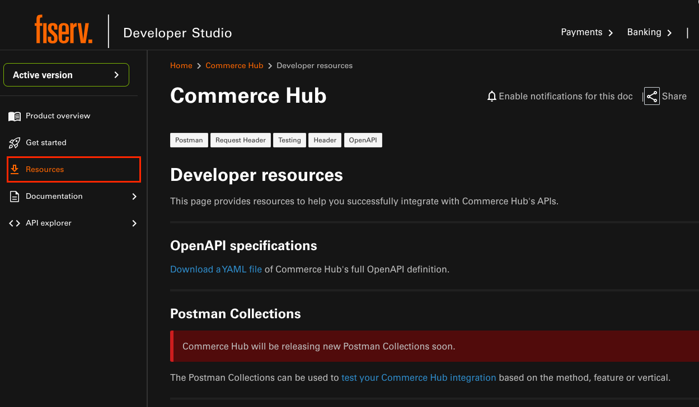
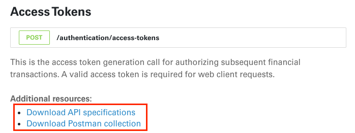
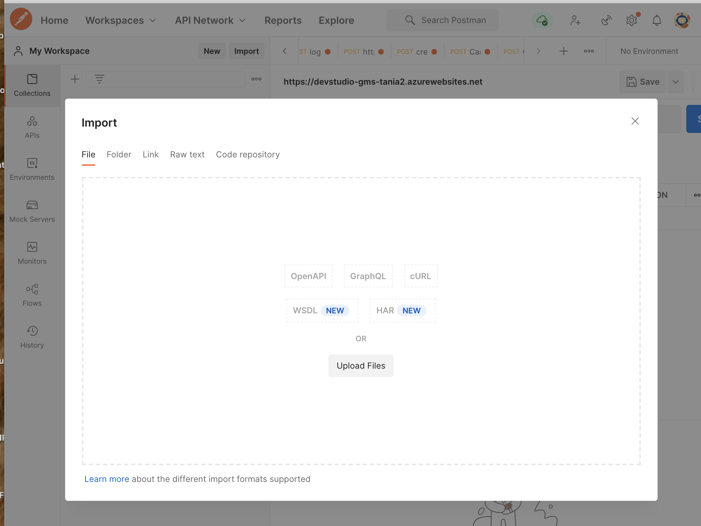
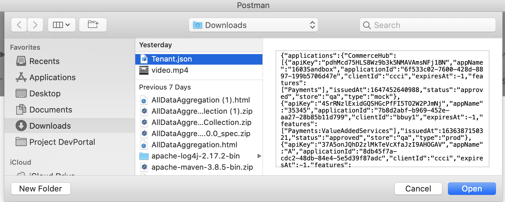
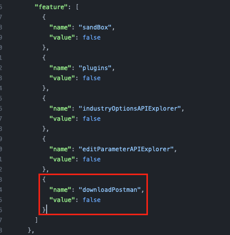

# How to Download and Test the Postman Collection

## Prerequiste
Postman

## Important Information
At the current moment, we can only provide auto-generated Postman and Openapi spec for **all** APIs being listed under each version as listed under `tenant.json - apiVersions`

If you would like to provide your own collection(s) of a certain set/subset of APIs (for better grouping or accessbility), please feel free to [generate your own Postman collection](https://learning.postman.com/docs/getting-started/importing-and-exporting/exporting-data/) and upload it in your `assets/files` and have download links available in a `resources.md` (or any similarly named document).

We highly recommend that you update and set your `Resources` navigation link to this document containing your various downloadable collections via `tenant.json - resourcesFilePath`.

## Download the API Postman Collection
Download the Postman collection on the API explorer page the using the Download Postman Collection button and download the json file in your local which you have to unzip and then you can directly import in your local postman.

Import the downloaded json file in the Postman application from your computer.

## Getting Started
To get started you can either fork the collection workspace within Postman or import the collection JSON file from this repo.

## Import the collection file into your workspace
If you don't want to fork the collection from the public workspace, you can import it from this repo.

Within your Postman workspace select the Import button

Next copy the downloaded APICollection.json contents and paste in the Paste Raw Text section of the import dialog

## Set your API key
Setup the Environment or Header for the API Key as needed in your API call(s)

## Make a test call
You should be ready now to make a test call if you are hosting your own Prism sandbox server to run the endpoint against. Please note that we do not provide our mock server's URL for you to test.

If you would like to run your own Prism mock server instance locally, please refer to the [Prism official documentation](https://docs.stoplight.io/docs/prism/f51bcc80a02db-installation).

## Disabling Postman download / Additional Resources section.
Tenant can disable this feature from Github repostitory by updating `tenant.json` configuration file.

Please note that this will disable download for all APIs.