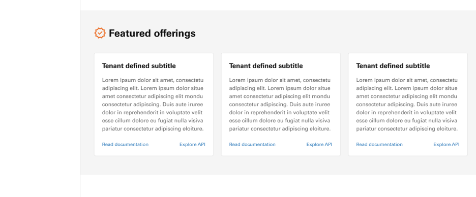
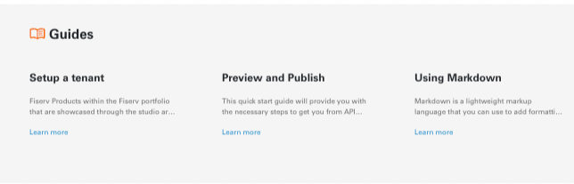
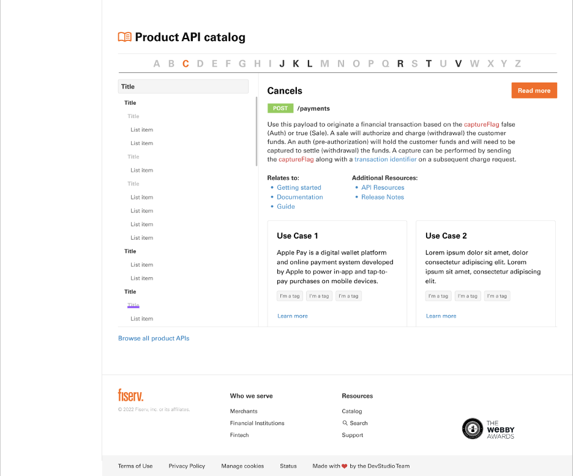

# Product Page Content Update

As part of our revamp and redesigning we have been upgrading all the primary pages (which includes the Product Page). Based on the usability testing and surveys conducted, our team has come up with a improved and seamless design to promote your products.
In order to achieve this Developer Studio is requesting all our tenants to provide some new information/content.

Tenants must provide ALL content for the new product page redesign,unless stated otherwise in this document. If no content or information is provided, “Lorem Ipsum” will be used and displayed on tenant’s final product page for sections that require content.
Below are the sections where tenants need to provide the information.

### Introduction 

For introduction, below Tenant’s name will be a description. Tenant may use their current description or provide a new one. 

MAX character count for description will be 510 characters, nothing more. 
Tenants are to provide a Get started document, which will be accessible through left navigation and “Get started” button below description.  
***If Tenant does not wish to provide, or does not have, the button selection will be removed from left navigation and under the description.*** 

Under introduction will be a section that is referred to as “benefits and outcomes,” with three columns of content displayed, as shown here:

This is where Tenant can showcase what are the benefits and outcomes of using their product.  
Tenant MUST provide 3 MIN/MAX benefit and outcomes. 
Title for each will be MAX ONE LINE (20 characters). 
Description for each will have a MAX character count of 145 characters, nothing more. 
Tenant can choose a correlating icon to their benefit/outcome from [Fiserv Approved Icons](https://fiservcorp-my.sharepoint.com/:p:/r/personal/alvin_cho_fiserv_com/_layouts/15/Doc.aspx?sourcedoc=%7BCEBDE9B3-8DDA-4E91-8915-1C8BD26BCB3A%7D&file=Fiserv%20Icon%20Gallery.pttx.pptx&action=edit&mobileredirect=true)  
Please keep in mind that icons will be 48x48px.  
***If Tenant does not provide or choose icons, then a default one created by the Developer Studio design team will be chosen.*** 

### Featured offerings 

This section is where Tenant may highlight/spotlight three of their product’s offerings/services and is defined by the Tenant on what they have to offer to users. 
- Tenant MUST provide 3 MIN/MAX offerings 
- Title for each card will be MAX ONE LINE (30 characters) 
- Description for each will have a MAX character count of 280 characters, nothing more. 
- Each offering will have two links that will lead to the documentation and API explorer of said offering. Tenants must ensure they have both in order to display offering. 
 

### Product offerings 

Product offerings” section will be where Tenant displays a selection of their product’s offerings. Tenant MAY NOT repeat any offerings that they have chosen for the “Featured offerings” section. This section is defined by the Tenant on what they have to offer to users. 
- Tenant must provide a group name for their offerings. 
- Group names are Tenant defined, they may choose an existing group name or create a new one that fits their grouped offerings.  
- Group names must be MAX ONE LINE (25 characters) 
***If Tenant does not provide group name, their offerings will be displayed without one.*** 

Each group will have 3 MIN/MAX offerings. 
- Each offering title will be MAX ONE LINE (25 characters) 
- Description for each will have a MAX character count of 260 characters, nothing more.  
- Each offering will have two links that will lead to the documentation and API explorer of said offering. Tenants must ensure they have both in order to display offering. 
- Tenant may provide up to a MAX of THREE groups (each group consisting of 3 MIN/MAX offerings).  
- MAX that can be displayed will be 3x3 total offerings (total of 9 offerings). 
 

### Guides 

Guides section will be where Tenant may display their guides.
- Tenant can provide up to a MAX of THREE guides 
- Each guide title will be MAX ONE LINE (25 characters) 
- Description for each will have a MAX character count of 73 characters, nothing more. 
- Each guide will have a link that will lead users to the guide’s documentation.  
If applicable, Tenant may create guides if they currently do not have any. 

***If Tenant does not provide any guides, then this section will not be displayed.*** 

### Product API catalog 
 
 
 
The Product API catalog section displays all available APIs within the Tenant. 
- Tenant may provide Use Cases for applicable APIs if they have 
- They may provide MAX 2 use cases 
- Each title will be MAX ONE LINE (25 characters) 
- Description will have a MAX character count of 140 characters, nothing more. 
- Tenants may choose applicable tags for use case, out of their existing tags. 
- Each use case will have a link that will lead users to the documentation of the use case. 
- They may also use this opportunity to create Use Cases for APIs if they don’t have 

**Other than Use Cases, Tenant DOES NOT have to provide any information or content for this section.** 

