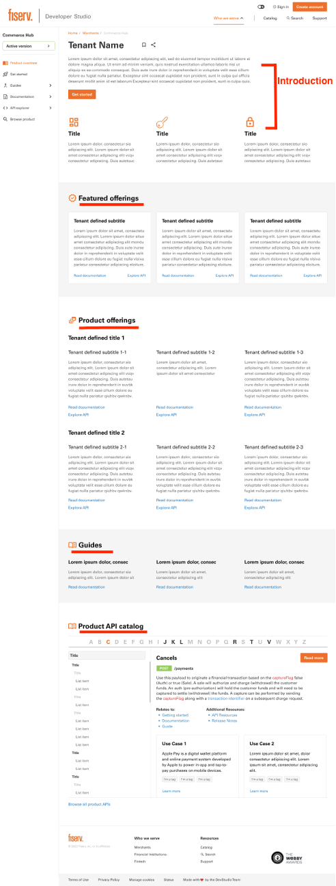
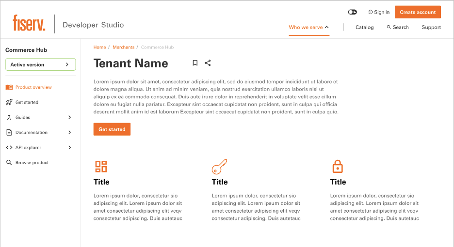
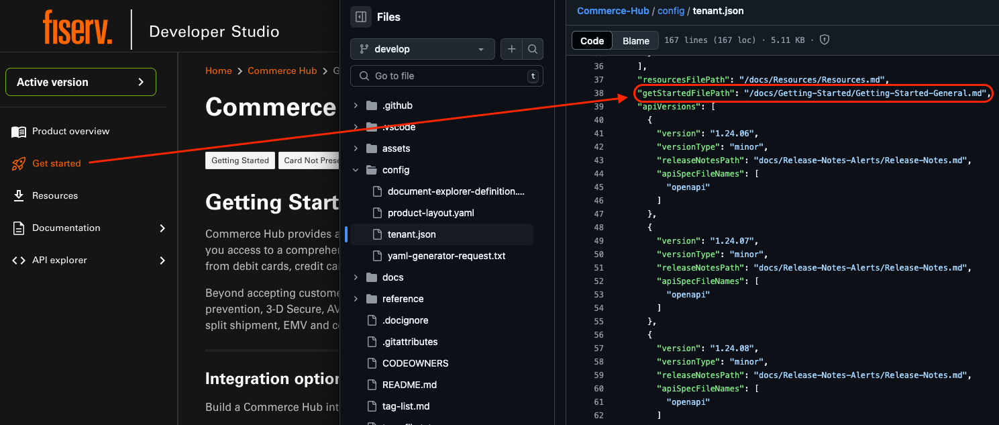
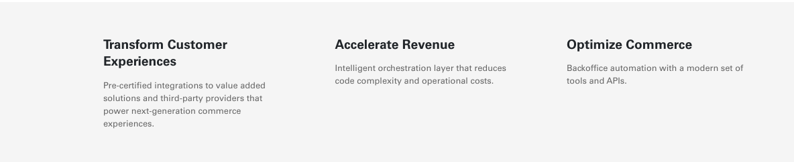
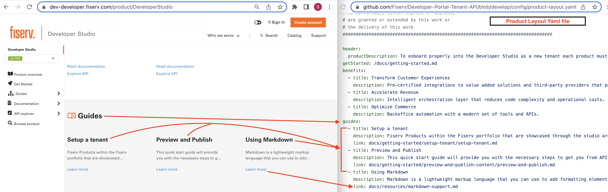
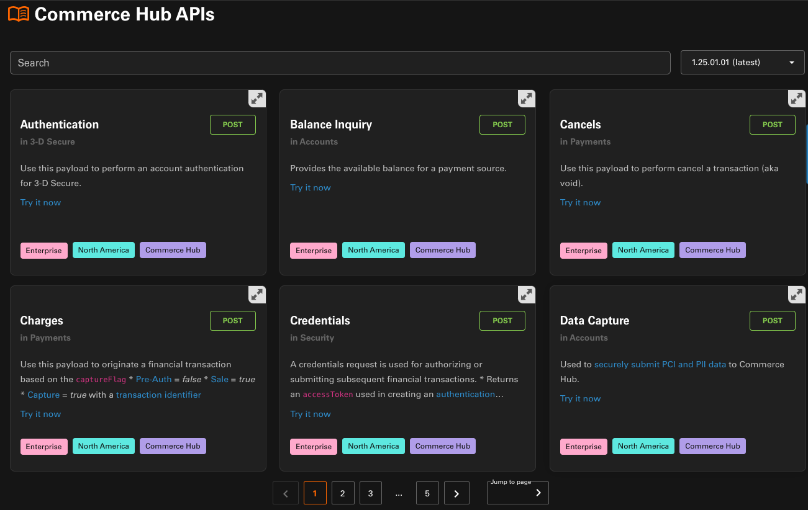

# Product Page Content Update

As part of our revamp and redesigning we have been upgrading all the primary pages (which includes the Product Page). Based on the usability testing and surveys conducted, our team has come up with a improved and seamless design to promote your products. In order to achieve this Developer Studio is requesting all our tenants to provide some new information/content.

Tenants should add/update the listed contents to the `product-Layout.yaml` file. Detailed description for the requirements and the sections where contents can be added is mentioned below.

Tenants must provide ALL content for the new product page redesign, unless stated otherwise in this document. If no content or information is provided, “Lorem Ipsum” will be used and displayed on tenant's final product page for sections that require content. Below are the sections where tenants need to provide the information.

## Introduction

For introduction, below Tenant's name will be a description. Tenant may use their current description or provide a new one.

MAX character count for description will be 510 characters, nothing more. Tenants are to provide a Get started document, which will be accessible through left navigation and “Get started” button below description.

The sample code snippet below mentions the actual file path of the getting-started.md file in the docs directory.
* `"getStartedFilePath": "<`_`Actual file path of the getting started markdown`_`>",`

Example: `"getStartedFilePath": "/docs/getting-started.md",`

Under introduction will be a section that is referred to as “benefits and outcomes,” with three columns of content displayed, as shown here:

This is where Tenant can showcase what are the benefits and outcomes of using their product.

* Tenant MUST provide 3 MIN/MAX benefit and outcomes.
* Title for each will be MAX ONE LINE (20 characters).
* Description for each will have a MAX character count of 145 characters, nothing more.

## Featured offerings

"Featured offerings" is a section to choose 3 offerings from your product offerings to spotlight (think of it as "featured product offerings") This section is where Tenant may highlight/spotlight three of their product's offerings/services and is defined by the Tenant on what they have to offer to users.

* Tenant MUST provide at least one and at most 3 offerings
* Title for each card will be MAX ONE LINE (30 characters)
* Description for each will have a MAX character count of 280 characters, nothing more.
* Each offering will have two links that will lead to the documentation and API explorer of said offering. Tenants must ensure they have both in order to display offering.

## Product offerings

Product offerings” section will be where Tenant displays a selection of their product's offerings. "Product offerings" is what you have to offer with your products (features, services, etc). Tenant MAY NOT repeat any offerings that they have chosen for the “Featured offerings” section. This section is defined by the Tenant on what they have to offer to users.

* Tenant must provide a group name for their offerings.
* Group names are Tenant defined, they may choose an existing group name or create a new one that fits their grouped offerings.
* Group names must be MAX ONE LINE (25 characters) _**If Tenant does not provide group name, their offerings will be displayed without one.**_
* Each group will have 3 MAX offerings.
* Each offering title will be MAX ONE LINE (25 characters)
* Description for each will have a MAX character count of 260 characters, nothing more.
* Each offering will have two links that will lead to the documentation and API explorer of said offering. Tenants must ensure they have both in order to display offering.
* Tenant may provide up to a MAX of THREE groups (each group consisting of 3 MAX offerings).
* MAX that can be displayed will be 3x3 total offerings (total of 9 offerings).

## Guides

Guides section will be where Tenant may display their guides.

* Tenant can provide up to a MAX of THREE guides
* Each guide title will be MAX ONE LINE (25 characters)
* Description for each will have a MAX character count of 73 characters, nothing more.
* Each guide will have a link that will lead users to the guide's documentation.\
  If applicable, Tenant may create guides if they currently do not have any.

_**If Tenant does not provide any guides, then this section will not be displayed.**_

## Product API catalog

The Product API catalog section displays all available APIs within the Tenant. This is automatically pulled from all the APIs provided on for every version as indicated in the `tenant.json`. This is technically not part of the `product-layout.yaml` configurations but we thought it would good to mention it anyways.

