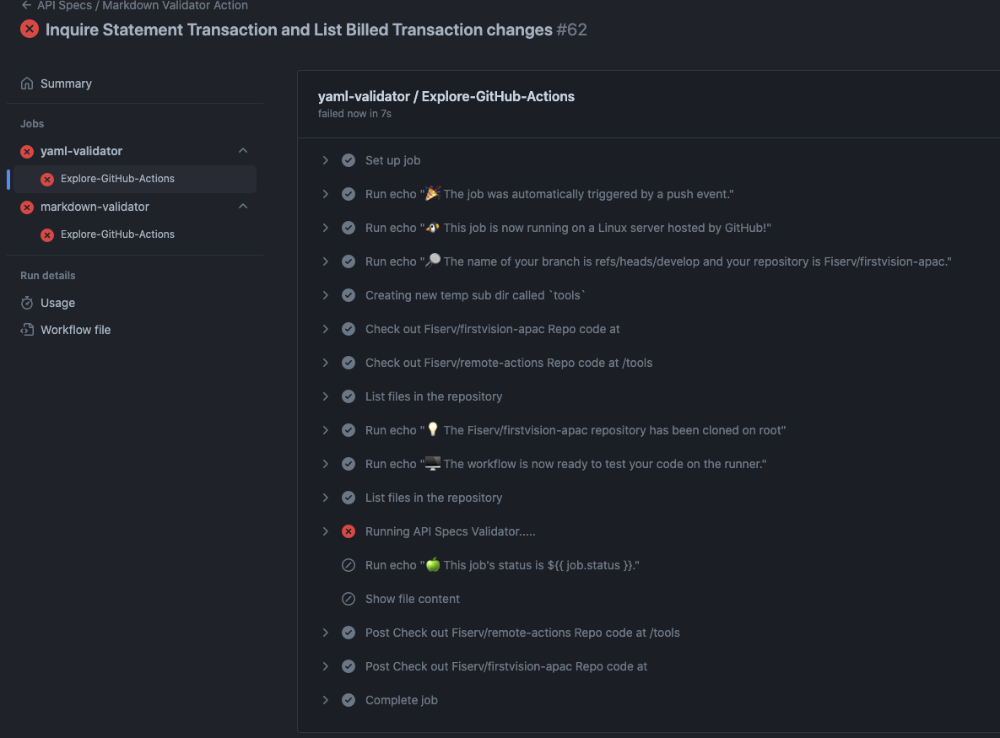
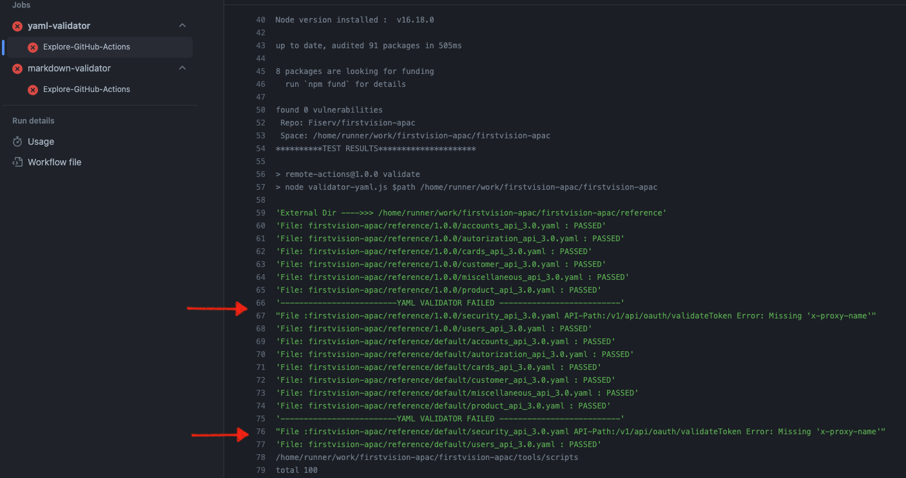

# Markdown File Validator

In order to protect Dev Studio and maintain standards amoung all Dev Studio tenants, tenants are configured with markdown validator. 

## Markdown Validation Check Rules

- Valid markdown file extension and formatting
- Links to downloadable files and embedded images should link to respective files in the Github repository
  - Images should be embedded such as ``
  - Downloadable docs should be formatted as `[downloadable file](download/assets/files/download.zip)`

## Markdown Validator Job

## API Validator Successful Activity

Checking every single API. Once validated logs will display name of the spec file and status. 

## API Validator failed Job

## API Validator failed Activity

Checking every single API. Once validated logs will display name of the spec file and status. 

Help: Please connect with DevStudio team for more information and questions related with Validators. 
