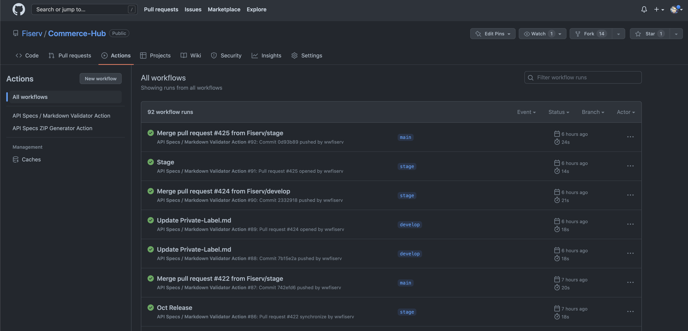

# DevStudio Github Validator

DevStudio has developed a validation technique for all Tenant Github content. Validation is performed to validate and test Tenant's various files such as API specs file ,markdown files ,document explorer defination ,Tenant.json files and more. Validation check at Github repository helps DevStudio team to maintain and preserve standards and rules within the Tenant managed content.

# Validator 'Github Workflow' powered by Github Action

DevStudio validators are powered by Github Actions. 

## Github Action and workflow

Github Action is an in-buit platform by Github for continous integration and continious developement. DevStudio Validators developed over Github workflows triggered by Github events such as Pull Request or Commits on feature branch(s).

## Available Validator

  * API Specification YAML file Validator
  * Markdown Validator
  * Documentation explorer defination
  * Tenant configuration file

## Navigating to Validator
 Every DevStudio is configured with Validator. To navigate github action please follow steps. 

1. Navigate to Tenant Github Repository

2. Click on Actions from Top Menu option

3. List of Actions workflow

4. Select latest workflow run
 
In order to see activity about the latest workflow job.

5. List of triggered Job

6. Activity from the Job

Help: Please connect with DevStudio team for more information and questions related with Validators. 

